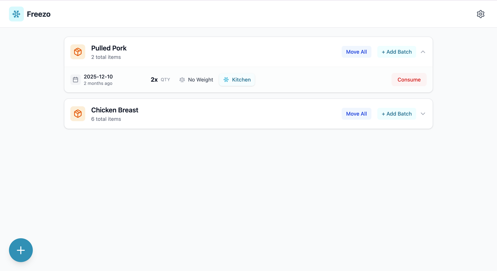

# Freezo

A simple, self-hosted application to track food inventory in your freezers. Built with Go, React, and SQLite, designed for homelab environments.



📚 **[View the Instructions Guide & user manual here!](docs/instructions.md)**

## Features

- **Freezer & Location Management**: Create and manage multiple virtual freezers (e.g., Kitchen Freezer, Garage Deep Freeze).
- **Categories & Icons**: Organize food items into default categories (*Pork, Seafood, Beef, Poultry, Bread, Uncategorized*) or create custom categories with custom icons.
- **Category & Freezer Filtering**: Quickly filter your inventory by freezer or category.
- **Inventory Tracking**: Track items by name, quantity, weight, category, and frozen date (defaults automatically to today's date).
- **Smart Grouping**: Group identical items automatically with batch consume and deduct capabilities.
- **Quick Transfers**: Move items between freezers with partial quantity support by clicking freezer badges or using the Move action.
- **Database Backup & Restore**: Export timestamped database backups (`freezo_backup_YYYY-MM-DD_HH-MM-SS.db`), restore from snapshots, or perform database resets.
- **Responsive UI**: Sleek, mobile-friendly interface built with React, Vite, and Lucide icons.

## Architecture

- **Backend**: Go (Golang) with Chi router, modernc SQLite engine (WAL mode with concurrency safety).
- **Frontend**: React (Vite) with Lucide icons and date-fns.
- **Deployment**: Kubernetes via Helm Chart (using Recreate strategy for PVC stability).

## Prerequisites

- Go 1.25+
- Node.js 22+
- Docker
- Kubernetes Cluster (e.g., k3s, minikube)
- Helm

## Local Development

You can run the backend and frontend in separate terminals:

**Terminal 1 (Backend):**
```bash
make run-backend
```

**Terminal 2 (Frontend):**
```bash
make run-frontend
```

**Running Tests:**
```bash
make test
```

## Release Process

### Application Release
To release a new version of the application (Frontend + Backend):
1. **Tag the release**:
    ```bash
    git tag v0.3.0
    git push origin v0.3.0
    ```
    This triggers the `release.yml` workflow which builds and pushes the Docker images.

### Helm Chart Release
To release a new version of the Helm chart:
1. **Update Config**: Bump `version` and `appVersion` in [Chart.yaml](file:///Users/riccardo/git/homelab/freezo/charts/freezo/Chart.yaml).
2. **Push**: Commit and push the change to `main`.
    This triggers the `chart-release.yml` workflow which packages and releases the chart to GitHub Pages.

## Deployment on Kubernetes

```bash
helm repo add freezo https://rpressiani.github.io/freezo
helm install freezo freezo/freezo
```

---

This project was vibe coded with [Google Antigravity](https://antigravity.google/) and Gemini 3.

